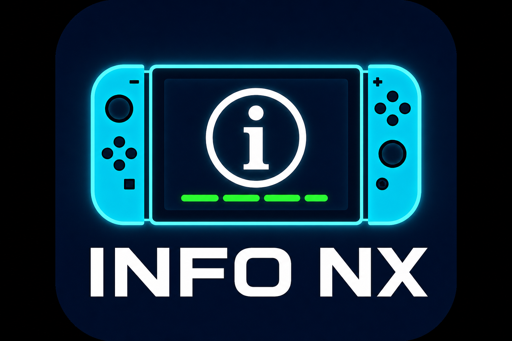

<div align="center">
  
  <h1>SwitchInfoNX</h1>
  <p><strong>Premium system information & hardware diagnostic utility for Nintendo Switch homebrew</strong></p>
  <p>
    
    
    
  </p>
  <br>
</div>

---

**Tiny description:**  
> All-in-one hardware monitor, diagnostics, system info & file transfer tool for the Nintendo Switch.

**Long description:**  
SwitchInfoNX is a feature-rich homebrew application that turns your Nintendo Switch into a diagnostics workstation. It provides a real-time overview of CPU/GPU/memory clocks, FPS, RAM & [...]

---

## ✨ Features

System Information  
Firmware version, serial number, hardware type (Erista/Mariko), region, language, battery level & charging status, Joy-Con battery, skin temperature, display brightness, blue light filter, uptime

Storage  
SD card usage, NAND partitions (USER/SYSTEM/SAFE), SD read speed test, homebrew app count

Network  
IP/MAC address, SSID, signal strength history graph (60s), connection time, Wi-Fi band detection

Performance  
Live CPU/GPU/MEM clock gauges, FPS counter with 60-frame line chart, RAM usage bar, CPU/GPU/MEM load indicators, performance score, temperature history, thermal alerts

Controller Diagnostics  
Full button/stick test, analog stick X/Y visualisation, trigger diagnostics, gyroscope & accelerometer six-axis sensor readout

Tools  
Display brightness control, haptic vibration motor test, dead-pixel screen test (R/G/B/W/B), system report export, perf metrics export, screenshot capture

File Browser  
Full SD card file manager with enter, back, delete, rename, copy, cut, paste — all touch-friendly

File Transfer  
Built-in MTP (Media Transfer Protocol) and HTTP Wi-Fi file transfer

Custom Themes  
15 built-in presets + full custom theme editor with real-time RGB color picker (10 UI slots)

i18n  
11 languages: English, French, Italian, Spanish, German, Portuguese, Dutch, Japanese, Russian, Chinese, Korean

Alerts  
Configurable temperature & memory usage thresholds with in-app toast notifications

---

## 📦 Installation

1. Download the latest `SwitchInfoNX.nro` from [Releases](https://github.com/dodosiiii/SwitchInfoNX/releases)
2. Copy it to `sdmc:/switch/SwitchInfoNX/` on your Switch SD card
3. Launch via any homebrew launcher (Atmosphère, HBMenu, etc.)

---

## 🛠 Building from source

### Prerequisites

Install [devkitPro](https://devkitpro.org/) with the following packages:

```bash
sudo dkp-pacman -S switch-dev switch-sdl2 switch-sdl2_ttf switch-sdl2_gfx \
  switch-freetype switch-harfbuzz switch-libpng switch-bzip2 switch-glm
```

### Build

```bash
git clone https://github.com/dodosiiii/SwitchInfoNX.git
cd SwitchInfoNX
make
```

The output `SwitchInfoNX.nro` will be placed in the project root.

---

## 🎮 Usage

| Button | Action |
|--------|--------|
| ← → / touch tabs | Navigate pages |
| ↑ ↓ | Scroll within pages (System, Storage, Network, Perf, Controller, About, Tools, Settings) |
| Y | Force refresh / export perf metrics |
| L / R | Previous / next page |
| Touch & drag | Scroll content, adjust sliders (brightness, theme editor) |

---

## ⚙️ Configuration

Settings are saved to `sdmc:/switch/SwitchInfoNX/config.txt`:

- **Language** — pick from 11 languages
- **Theme** — 15 presets or fully custom (RGB editor)
- **Auto-refresh** — Off / 1s / 3s / 5s / 10s
- **Temperature alert** — custom threshold (default 70.0 °C)
- **Memory alert** — custom threshold (default 85 %)

---

## 🧰 Tech Stack

| Component | Library |
|-----------|---------|
| Graphics | SDL2 + SDL2_ttf + SDL2_gfx |
| Fonts | FreeType + HarfBuzz |
| Hardware | libnx (switch.h) |
| File transfer | Custom MTP stack (20+ files) |
| Toolchain | devkitA64 (aarch64-none-elf-gcc) |

---

## 📄 License

This project is open source. See the source files for details.

---

<div align="center">
  <sub>Built with ❤️ by dodosiiii</sub>
  <br>
  <sub>Nintendo Switch is a trademark of Nintendo Co., Ltd. This is an unofficial homebrew project.</sub>
</div>
